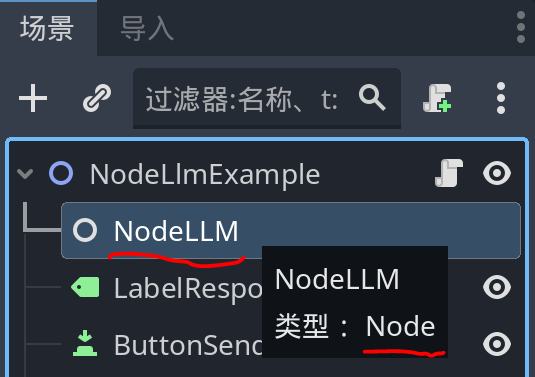
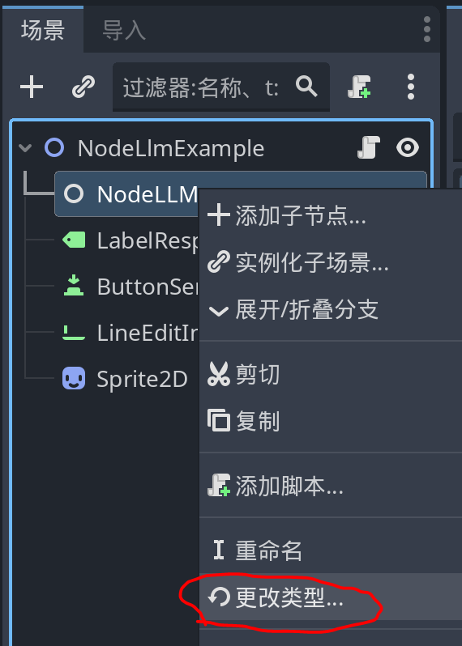
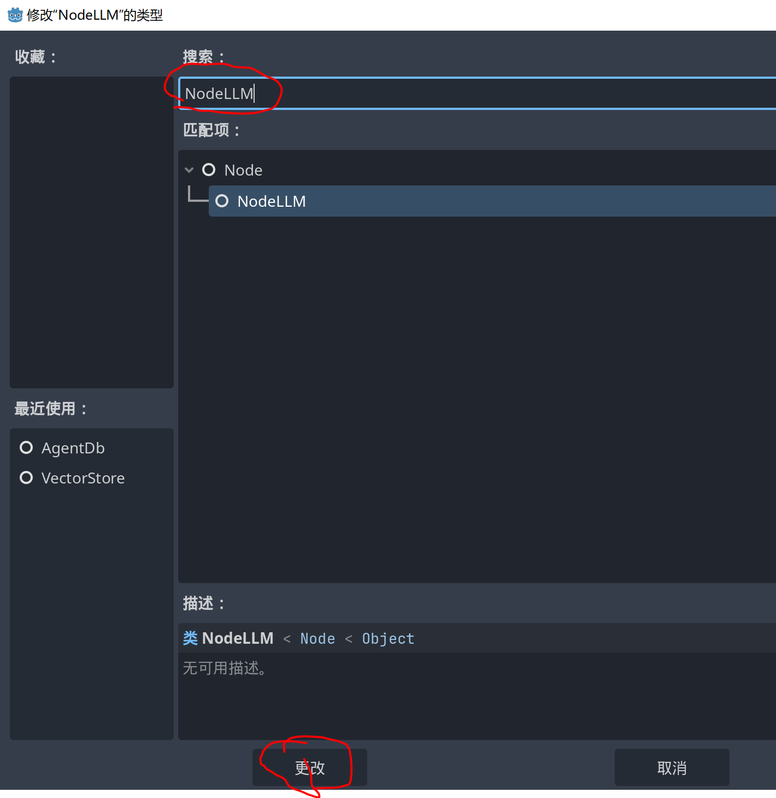

# NodeLLM Example
```admonish
Fix NodeLLM Type Lost
Due to plugins provided node type, the newly download example may lose it's type, back to Node base type.
```

```admonish example


**We can change the node type back as following:**



**Choose NodeLLM**


```